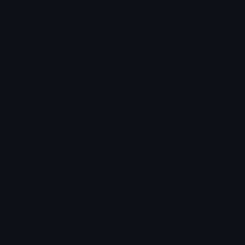

### Olá Mundo... brinks, kkk 😅. 
### Sou o Lucas Batista, especialista em desenvolvimento móvel e esse é meu GitHub
#### Ah... e esse é o meu [Gist](https://gist.github.com/LucasFebatis)

- 🔭 Hoje trabalho com **mobile**
- 🌱 Estou estudando **Flutter** e **Elastic Stack**
- ⚡ *Fun fact*: Sim, já deixei uma máquina EC2 parada lá na AWS gastando, então: "Anytime! Jeff"

<a href="https://github.com/LucasFebatis" target="_blank">
  
 
    
    
    
    
    
    
    
    
    
  

</a>

##
 
<!--    -->
   

  <a href="https://github.com/LucasFebatis">
  
  

  
### Destaques
  
<table>
  <tbody>
      <tr>
        <td>
          <a href="https://github.com/LucasFebatis/super-hero-febatis-app">
           
        </td>
        <td>
          <a href="https://github.com/LucasFebatis/tvam">
           
        </td>
      </tr>
      <tr>
        <td>
          <a href="https://github.com/LucasFebatis/customsnackbar">
           
        </td>
        <td>
          <a href="https://github.com/LucasFebatis/pug-runner-game-android">
           
        </td>
      </tr>
  </tbody>
</table>

  
 
  
